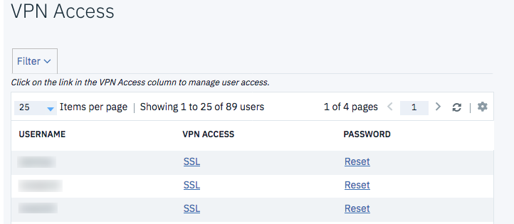

---

copyright:
  years: 1994, 2017-2019
lastupdated: "2019-03-06"

keywords: VPN access, IBM Cloud VPN, user account

subcollection: iaas-vpn

---

{:shortdesc: .shortdesc}
{:new_window: target="_blank"}

{:DomainName: data-hd-keyref="DomainName"}
{:note: .note}
{:important: .important}
{:deprecated: .deprecated}
{:generic: data-hd-programlang="generic"}

# Einführung in die Arbeit mit VPN (Virtual Private Networking)
{:#gettingstarted-with-virtual-private-networking}

## Was ist IBM Cloud-VPN?
{:#what-is-ibmcloud-vpn}

VPN-Zugriff ermöglicht den Benutzern, alle Server remote und sicher über das private Netz einer IBM Cloud zu verwalten. Die VPN-Verbindung von Ihrem Standort zum privaten Netz ermöglicht Out-of-band-Management und Serverrettung über einen verschlüsselten VPN-Tunnel. Mit VPN-Zugriff verfügen Sie über folgende Möglichkeiten:

* Aufbau einer VPN-Verbindung zu einem privaten Netz über SSL oder IPsec
* Zugriff auf den Server über die private 10.x.x.x-IP-Adresse über SSH oder RDP
* Verbindung zur IPMI-IP-Adresse des Servers zur zusätzlichen Serververwaltung oder zu Rettungszwecken

**PPTP-VPN-Services werden ab 12. Juni 2018 nicht weiter unterstützt, wie in der entsprechenden, kürzlich veröffentlichten [Ankündigung](/docs/infrastructure/iaas-vpn?topic=VPN-pptp-vpn-deprecation) beschrieben.**
{:deprecated}

Für eine Reihe an Services ist der Zugriff über das private Netz erforderlich, und das VPN ist eine Methode, durch die Zugriff auf das private Netz möglich ist. Die Verwendung eines VPNs ist sinnvoll, wenn Sie sich an einem privaten Netz anmelden, danach arbeiten und schließlich wieder abmelden müssen. Ein solcher Zugriff ist zum Beispiel oft für die Kommunikation mit der KVM des Servers erforderlich.

Jedem Benutzerkonto kann VPN-Zugriff erteilt werden; außerdem kann der Zugriff für jedes Benutzerkonto auf die Teilnetze begrenzt werden, auf die der Zugriff erforderlich ist. Der VPN-Zugriff muss aktiviert sein und Sie müssen ein VPN-Kennwort erstellen, damit Sie sich am VPN anmelden können.

## VPN-Zugriff jedes einzelnen Benutzers aktivieren
{:#enable-user-vpn-access}

Zu Beginn müssen Sie den VPN-Zugriff für jedes Konto aktivieren, für das VPN-Zugriff erforderlich ist. Der VPN-Zugriff ist für jedes Konto zunächst **inaktiviert**, auch für das Stammkonto des Teams. Führen Sie die folgenden Schritte aus, um den VPN-Zugriff zu aktivieren:

1. Wechseln Sie zu **Konto -> VPN-Zugriff** im [Kundenportal ](https://control.softlayer.com/).
* An dieser Stelle finden Sie die Zeile für jeden möglichen VPN-Benutzer und einen Link unter der Spalte **VPN-Zugriff**.
* Der Link trägt die Bezeichnung 'Keine' (None), wenn der Benutzer den VPN-Zugriff noch nicht aktiviert hat.
* Wenn die Bezeichnung für den VPN-Zugriffslink **SSL** lautet, bedeutet dies, dass der Benutzer den VPN-Zugriff bereits aktiviert hatte.

1. Wenn Sie die für einen bestimmten Benutzer zulässigen VPN-Zugriffstypen aktiveren oder ändern möchten, klicken Sie auf den Link unter der Spalte **VPN-Zugriff**.
* Auf der nächsten Seite können Sie den VPN-Zugriffstyp aktivieren, der für jeden einzelnen Benutzer geeignet ist.  

## VPN-Kennwort festlegen
{:#set-vpn-password}

Der nächste Schritt ist die Erstellung eines VPN-Kennworts. Jeder Benutzer kann sein VPN-Kennwort im [Kundenportal ](https://control.softlayer.com/) erstellen und aktualisieren. Wählen Sie hierzu in der rechten oberen Ecke Ihren Namen aus; daraufhin wird die Seite **Profil bearbeiten** angezeigt. Sie können auch **Konto -> Benutzer** und danach Ihren Namen auswählen.

      Hinweis: Der Link lautet 'Masterbenutzer'. In diesem Link wird Ihr Name für Unterbenutzer angezeigt.

Blättern Sie auf der Seite **Benutzerprofil bearbeiten** abwärts und initialisieren oder aktualisieren Sie das VPN-Kennwort.

## Melden Sie sich am VPN an.
{:#login-to-the-vpn}

Da der VPN-Zugriff jetzt eingerichtet ist, können Sie sich anmelden.

1. Besuchen Sie zum Anmelden am SSL-VPN [vpn.softlayer.com](https://vpn.softlayer.com/) und wählen Sie einen Anmeldepunkt aus. Sie können jeden VPN-Zugriffspunkt verwenden und erhalten in allen Rechenzentren dieselben Zugriffsrechte auf das private Netz.
* Falls Sie Probleme beim Anmelden an einem Standort haben, versuchen Sie es mit einem anderen Standort.
* Alternativ können Sie sich unter Verwendung des SSL-VPNs des eigenständigen Clients anmelden.
