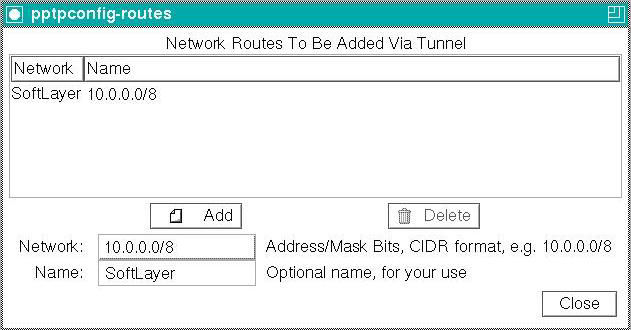

---
copyright:
  years: 1994, 2017
lastupdated: "2017-12-01"
---

{:shortdesc: .shortdesc}
{:new_window: target="_blank"}

# Configuration de PPTP pour Fedora Core 5

Vous devrez procéder à certaines installations et configurations.

**1. Installation**
Installez PPTP et l'interface graphique `pptpconfig` avec l'une des commandes suivantes :
```
# rpm -Uvh http://pptpclient.sourceforge.net/yum/stable/fc5/pptp-release-current.no...
# yum --enablerepo=pptp-stable install pptpconfig
```

**2. Configuration**

1. Informations sur le PPTP IBM Cloud :
<table><tr><td>Serveur :</td><td>pptpvpn.dal01.softlayer.com (Dallas)<br/>pptpvpn.sea01.softlayer.com (Seattle)<br/>pptpvpn.wdc01.softlayer.com (Washington D.C.)</td></tr><tr><td>Nom de domaine :</td><td>Laissez vide</td></tr><tr><td>Nom d'utilisateur :</td><td>(exemple : SL12345)</td></tr><tr><td>Mot de passe :</td><td>&nbsp;</td></tr></table>

2. Exécutez *pptpconfig* <span style="text-decoration: underline">en tant qu'utilisateur root</span> ; une fenêtre s'affiche. <br/>


3. Entrez le nom, le serveur, le nom d'utilisateur et le mot de passe dans l'onglet Serveur.

4. Dans la section Chiffrement, conservez toutes les valeurs par défaut car elles conviennent pour la plupart des clients.<br/>


5. Cliquez sur *Ajouter* ; le tunnel s'affiche dans la liste. 

6. Cliquez sur le tunnel pour le sélectionner, puis cliquez sur *Démarrer*. Une fenêtre qui indique le statut et le journal de connexion du tunnel s'affiche. 

7. Si la connexion échoue, d'autres informations sont sans doute nécessaires. Auquel cas, dans l'onglet *Miscellaneous*, cliquez sur *Enable connection debugging facilities* et sur *Update*. Cliquez de nouveau sur *Démarrer* et regardez quelle erreur est signalée dans [Diagnosis HOWTO](http://pptpclient.sourceforge.net/howto-diagnosis.phtml){:new_window}.<br/>


8. Si la connexion réussit, vous pouvez cliquer sur le bouton de test Ping. Si le test ping échoue, essayez de savoir pourquoi avant de continuer. Si le test ping réussit, cela signifie que le tunnel est actif et que vous pouvez désormais travailler sur le routage.

9. Seules les adresses IP actives sur le réseau de back end d'IBM Cloud peuvent être routées via ce tunnel VPN. *Arrêtez* le tunnel, sélectionnez-le de nouveau, puis cliquez sur *Client to LAN ou LAN to LAN* dans l'onglet *Routage*, cliquez sur le bouton *Edit Network Routes* et entrez '10.0.0.0/8' dans la zone Réseau et SoftLayer dans la zone Nom, puis cliquez de nouveau sur *Démarrer*. Maintenant, essayez d'accéder à l'adresse IP privée de votre serveur ou au serveur de noms privé de SoftLayer à l'adresse 10.0.80.11.<br/>

