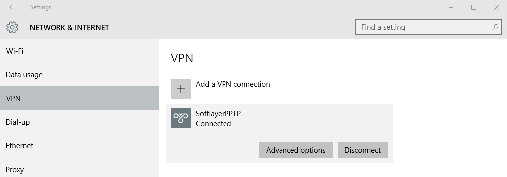

---
copyright:
  years: 1994, 2017
lastupdated: "2017-12-01"
---

{:shortdesc: .shortdesc}
{:new_window: target="_blank"}

# Windows 10 での PPTP VPN のセットアップ

1. **スタート**・メニューから**「設定」**アプリケーションを起動し、**「ネットワークとインターネット」**をクリックします。

2. **「ネットワークとインターネット」**パネルの左側にある**「VPN」**をクリックし、後続のページで**「VPN 接続を追加する」**を選択します。


3. 以降のページで、PPTP VPN 接続をセットアップします。設定は以下のとおりです。

 * _VPN プロバイダー:_ Windows (組み込み)
 * _接続:_ この接続に名前を付ける必要があります (例: `MyPPTP`)。
 * _サーバー名またはアドレス:_ 接続するサーバーの名前を入力します。(例: `pptpvpn.dal01.softlayer.com`)
 * _VPN タイプ:_ 「Point-to-Point トンネリング・プロトコル」(PPTP) を選択します。
 *_ サインインのタイプ:_ 「ユーザー名とパスワード」を選択します。
  * VPN ユーザー名とパスワードを入力します。
  * 選択したすべてのデータを再確認し、**「保存」**をクリックします。


4. VPN のメインページに戻ったら、`MyPPTP` 接続 (作成したもの) を選択して接続します。



5. 接続中にインターネットを使用するには、リモート・ゲートウェイを無効にする必要があります。これは PowerShell を使用して行うことができます。

 * PowerShell を右クリックして**「管理者として実行」**を選択し、PowerShell を開きます。
 * 以下のコマンドを入力します。
 ```
`Get-VpnConnection`
`Set-VpnConnection -Name "MyPPTP" -SplitTunneling $True`
```
