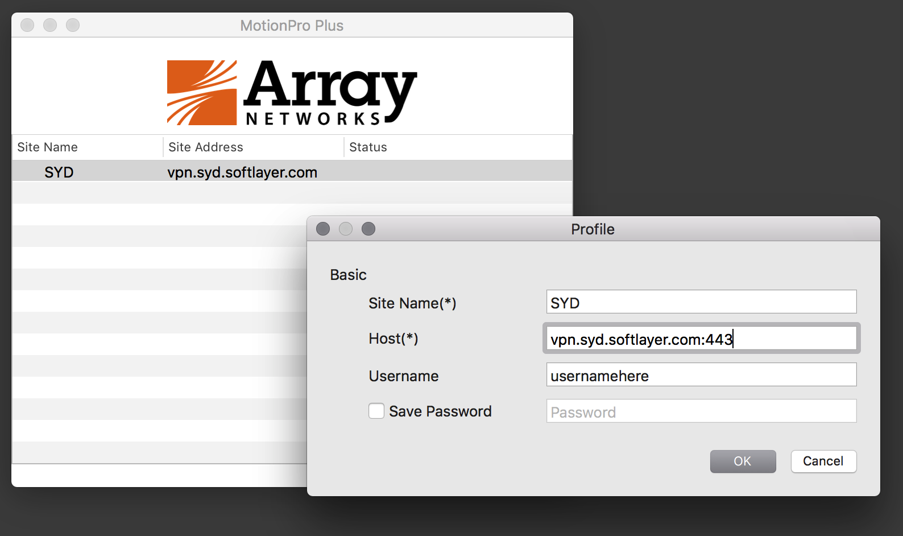

---
copyright:
  years: 1994, 2017
lastupdated: "2017-12-01"
---

{:shortdesc: .shortdesc}
{:new_window: target="_blank"}

# Clientes VPN independentes - Windows, Linux e Mac OS X

## Cliente independente do Windows

Windows (8/7/Vista/XP) de 32 bits:  https://speedtest.dal05.softlayer.com/array/ArrayMotionProSetup_win32_v1.1.3.zip

Windows (8/7/Vista/XP) de 64 bits:  https://speedtest.dal05.softlayer.com/array/ArrayMotionProSetup_win64_v1.1.3.zip

1. Faça download de um dos arquivos listados acima, dependendo de seu sistema operacional.
* Execute MotionProSetup para instalar o software.
* Execute MotionPro e na tela de abertura selecione **Perfil -> Incluir**.
* Crie um perfil dando a ele um Nome do site, escolhendo um nome do host na lista de sites de VPN SSL (abaixo). Em seguida,
insira seu nome de usuário e senha da VPN e pressione **Salvar**.
* Finalmente, clique duas vezes no perfil que acabou de criar para se conectar à VPN.

**Notas**
 * 'Site' pode ser um nome de domínio ou um endereço IP.
 * Se você tiver problemas, desinstale qualquer programa de Matriz usando o Painel de Controle do Windows, reinicialize e, em
seguida, reconecte-se.
 * Não funciona no Windows 8 RT.

## Cliente independente do Linux

CentOS de 64 bits: https://speedtest.dal05.softlayer.com/array/MotionPro_Linux_CentOS_x86-64_1.0.4.sh

Redhat de 32 bits: https://speedtest.dal05.softlayer.com/array/MotionPro_Linux_RedHat_x86-32_1.0.4.sh

Redhat de 64 bits: https://speedtest.dal05.softlayer.com/array/MotionPro_Linux_RedHat_x86-64_1.0.4.sh

Ubuntu de 32 bits: https://speedtest.dal05.softlayer.com/array/MotionPro_Linux_Ubuntu_x86-32_1.0.4.sh

Ubuntu de 64 bits: https://speedtest.dal05.softlayer.com/array/MotionPro_Linux_Ubuntu_x86-64_1.0.4.sh

1. Torne-o executável: `chmod +x MotionPro_Linux_CentOS_x86-64_1.0.4.sh`
* Execute o script: `./MotionPro_Linux_CentOS_x86-64_1.0.4.sh.`
* Uso: `./MotionPro --host [site] --user [username] --passwd [password]`
* Para pará-lo: `[control-c]`

**Observações:**  
 * Para iniciar o cliente MotionPro, deve-se inserir pelo menos o `hostname` e
o `username` como argumentos.
 * 'Site' pode ser um nome de domínio ou um endereço IP.

## Cliente independente Mac OS X 10.10

Etapas para o cliente Motion Pro Plus da VPN SSL da matriz independente MacOS:

1. Instale o cliente "Motion Pro Plus" da loja da Apple.
* Localize o cliente do Motion Pro Plus sob a pasta Aplicativos e abra o aplicativo.
* Clique em 'Perfil' e depois em 'Incluir'.
* Preencha o nome do site, host e nome de usuário e, em seguida, clique em Ok.
* Clique na VPN na parte superior esquerda e, em seguida, se conecte.

Um exemplo pode ser localizado com o seguinte:

Se o túnel não estiver direcionando o tráfego corretamente, poderá ser necessário [incluir rotas manualmente](https://discussions.apple.com/thread/2735376).

*Desinstale quaisquer versões anteriores antes de atualizar.*

## POPS da VPN de SSL (sites)

* vpn.ams01.softlayer.com
* vpn.ams03.softlayer.com
* vpn.dal01.softlayer.com
* vpn.dal05.softlayer.com
* vpn.dal06.softlayer.com
* vpn.dal07.softlayer.com
* vpn.dal09.softlayer.com
* vpn.sea01.softlayer.com
* vpn.wdc01.softlayer.com
* vpn.wdc04.softlayer.com
* vpn.hou02.softlayer.com
* vpn.sjc01.softlayer.com
* vpn.sjc03.softlayer.com
* vpn.sng01.softlayer.com
* vpn.atl01.softlayer.com
* vpn.chi01.softlayer.com
* vpn.den01.softlayer.com
* vpn.lax01.softlayer.com
* vpn.mia01.softlayer.com
* vpn.nyc01.softlayer.com
* vpn.hkg02.softlayer.com
* vpn.lon02.softlayer.com
* vpn.sao01.softlayer.com
* vpn.mil01.softlayer.com
* vpn.mel01.softlayer.com
* vpn.tor01.softlayer.com
* vpn.mex01.softlayer.com
* vpn.fra02.softlayer.com
* vpn.par01.softlayer.com
* vpn.syd01.softlayer.com
* vpn.che01.softlayer.com
* vpn.mon01.softlayer.com
* vpn.tok02.softlayer.com

**Observe: desinstale quaisquer versões anteriores do cliente antes de instalar a nova versão.**
