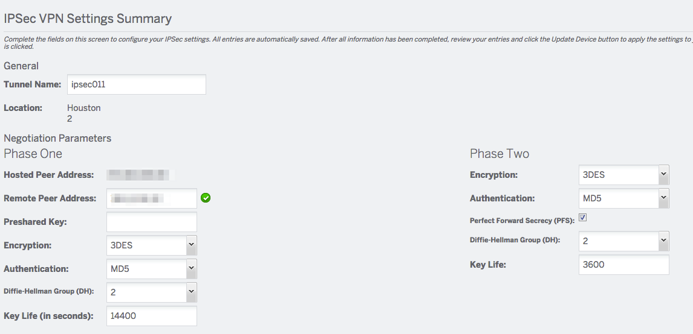

---

copyright:
  years: 1994, 2017-2019
lastupdated: "2019-03-06"

keywords: IPSec VPN, IP address, IP traffic

subcollection: iaas-vpn

---

{:shortdesc: .shortdesc}
{:new_window: target="_blank"}
{:DomainName: data-hd-keyref="DomainName"}
{:note: .note}
{:important: .important}
{:deprecated: .deprecated}
{:generic: data-hd-programlang="generic"}

# 設定 IPSec VPN
{:#setup-ipsec-vpn}

## 何謂 IPSec VPN？
{:#what-is-ipsec-vpn}

IPSec 是一套通訊協定，其設計是用來針對兩個位置之間的所有 IP 資料流量進行鑑別與加密，並且使用通道模式來提供已加密的站對站 (site-to-site) 網路。它可讓受信任的資料通過在其他方面被視為不安全的網路。如需有關 IPSec 的一般資訊，請參閱[參考文件](/docs/infrastructure/iaas-vpn?topic=VPN-external-reference-documentation)。

IBM Cloud 的 VPN 存取可讓使用者透過 IBM Cloud 的專用網路，從遠端安全地管理所有伺服器。從您的位置至專用網路的 VPN 連線，讓您能透過已加密的 VPN 通道進行頻外管理，以及伺服器救援。使用 VPN 存取，您可以：

   * 透過 SSL 或 IPSEC 建立與專用網路的 VPN 連線。
   * 透過 SSH 或 RDP，以伺服器的專用 10.x.x.x IP 位址存取伺服器。
   * 連接至伺服器的 IPMI IP 位址，以處理其他伺服器管理或救援需求。

我們為客戶提供 IPSec 服務，以管理其環境。不建議用於正式作業工作負載。

## 設定 IPSec 連線
{:#setup-ipsec-connection}

### 協商參數
{:#setup-ipsec-vpn-negotiation-parameters}

您需要知道 IPSec VPN 遠端的下列資訊：
- VPN 端點的靜態 IP 位址
- 預先共用的金鑰（密碼）
- 加密演算法（DES、3DES、AES128、AES192、AES256）
- 鑑別（MD5、SHA1、SHA256，適用於階段 1&2）
- Diffie-Hellman Group（適用於階段 1&2）
- 是否使用完全秘密轉遞 (PFS)？
- Keylife 時間（針對階段 1 & 2）- **附註**：我們的系統以秒為單位來測量此值！

您有這項資訊之後，即可配置 VPN 連線的基本協商參數。

### 受保護網路
{:#setup-ipsec-vpn-protected-networks}

在 VPN 連線內容中，您必須在通道的遠端系統以及通道的本端網路上定義網路。在「受保護的客戶（遠端）子網路」中，針對 IPSec 通道遠端（非 IBM 端），以 CIDR 表示法輸入專用 IP 位址空間。

例如：如果通道遠端的網路使用單一子網路 10.0.0.0 ，且網路遮罩為 255.255.255.0，則您將針對「受保護的客戶（遠端）子網路」區段輸入 IP 位址 10.0.0.0 / CIDR 24。

### 網址轉換 (Network Address Translation, NAT)
{:#setup-ipsec-vpn-nat}

使用 IPSec VPN，您也可以在 {{site.data.keyword.BluSoftlayer_notm}} 網路上定義專用 IP 位址，以將資料流量遞送至 VPN 連線另一端的遠端子網路。這可讓您將「專用網際網路」資料流量轉遞至 VPN 後方機器的其中一個內部 IP 位址，而不讓遠端位置公開接受完整網際網路存取。  

### 網址轉換/指派的靜態 NAT 子網路
{:#setup-ipsec-vpn-nat-static-subnets}

若要配置具有靜態 NAT 項目的遠端 VPN IP，請執行下列動作： 

 * 選取紅色箭頭，以在**指派的靜態 NAT 子網路**區段中顯示子網路清單。將會顯示子網路中的每一個 IP。  
 * 在**客戶 IP**直欄下，輸入 VPN 連線遠端系統的 IP，然後在**名稱**直欄下，輸入對映的名稱。  
 * 選取**新增/修改環境定義位址轉換**及**套用配置**，以儲存並套用配置。
 
此動作會為返回資料流量設定靜態的一對一網路轉換，供 IBM Cloud VPN 集中器後方的主機用來與遠端 VPN 同層級後方的主機進行通訊。例如，IP 10.1.255.92 的所有資料流量都將轉換並轉遞至客戶的 IP 192.168.10.15。有了這項轉遞作業，便不需要 IBM Cloud 伺服器上的額外路徑項目。
