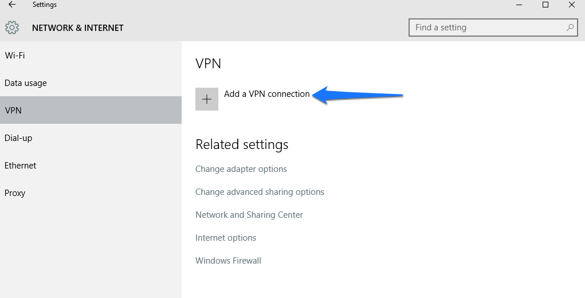
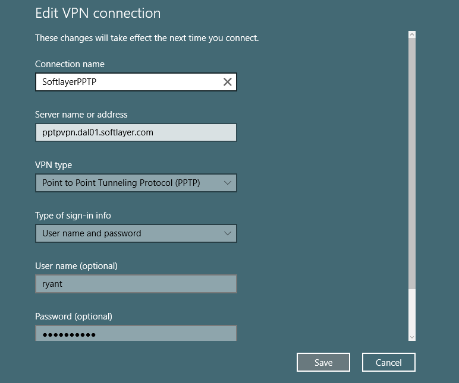

---
copyright:
  years: 1994, 2017
lastupdated: "2017-12-01"
---

{:shortdesc: .shortdesc}
{:new_window: target="_blank"}

# 在 Windows 10 中設定 PPTP VPN

1. 從**開始**功能表啟動**設定**應用程式，然後按一下**網路和網際網路**。

2. 在**網路和網際網路**畫面的左側畫面中，選取 **VPN**，然後在後續的頁面中，選取**新增 VPN 連線**。



3. 在接下來的頁面上，您將設定 PPTP VPN 連線。設定如下：

 * _VPN 提供者：_Windows（內建）
 * _連線：_您必須提供這個連線的名稱，例如 `MyPPTP`。
 * _伺服器名稱或位址：_輸入您要聯繫的伺服器名稱。（例如 `pptpvpn.dal01.softlayer.com`）
 * _VPN 類型：_選擇「點對點通道通訊協定 (PPTP)」
 * _登入資訊的類型：_選擇「使用者名稱和密碼」
  * 現在，輸入 VPN 使用者名稱和密碼
  * 再次檢查所有選取的資料，然後按**儲存**



4. 回到主要 VPN 頁面之後，選取您稍早建立的 `MyPPTP` 連線，即可進行連接。


5. 若要在已連接時使用網際網路，您必須停用遠端閘道，這可以透過 PowerShell 來執行。

 * 在 PowerShell 按一下滑鼠右鍵，然後選取**以系統管理員身分執行**，來開啟 PowerShell
 * 鍵入下列指令：
 ```
`Get-VpnConnection`
`Set-VpnConnection -Name "MyPPTP" -SplitTunneling $True`
```
